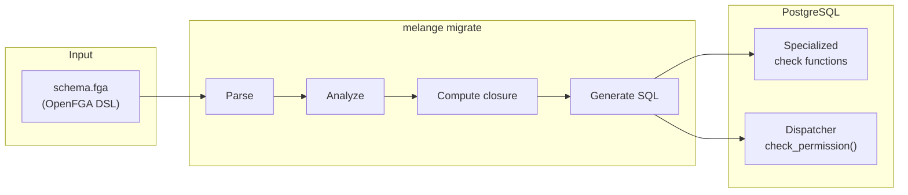

Melange is an **OpenFGA-to-PostgreSQL compiler**. It reads your authorization model and compiles it into specialized SQL functions that execute permission checks directly in your database — no external service, no network hops, no tuple synchronization.

## The two-phase model

Like [Protocol Buffers](https://protobuf.dev/) compiles `.proto` files into language-specific serialization code, Melange compiles `.fga` files into PostgreSQL functions. The key insight is **when** the schema is processed:

| | Traditional FGA | Melange |
|---|---|---|
| **Schema processing** | Interpreted at query time | Compiled at migration time |
| **Permission check** | Generic graph traversal | Purpose-built SQL function call |
| **Role hierarchies** | Resolved recursively at runtime | Precomputed at compile time |
| **Data storage** | Separate tuple service | View over your own tables |

<Columns cols={2}>
  <Card title="Compile time" icon="hammer">
    You run `melange migrate`. The compiler parses your schema, analyzes every relation, and installs optimized SQL functions into PostgreSQL.
  </Card>
  <Card title="Runtime" icon="bolt">
    Your application calls `check_permission(...)`. PostgreSQL executes the precompiled function — no schema interpretation, no external service.
  </Card>
</Columns>

## What happens during `melange migrate`

<Steps>
  <Step title="Parse">
    The compiler reads your `.fga` schema file and produces a typed in-memory representation of every `type` and `relations` block.
  </Step>
  <Step title="Analyze">
    Each relation is classified by its pattern — direct assignment, union, intersection, exclusion, tuple-to-userset, or role hierarchy. This analysis drives the shape of the generated SQL.
  </Step>
  <Step title="Compute closure">
    Role hierarchies are resolved into a **precomputed closure table**. For a hierarchy `owner → admin → member`, the closure records that `member` is satisfied by `member`, `admin`, and `owner`. This eliminates recursive lookups at runtime.
  </Step>
  <Step title="Generate SQL">
    The compiler emits a specialized `check_*` function for every relation, plus dispatcher functions (`check_permission`, `check_permission_internal`) that route calls to the right function.
  </Step>
  <Step title="Install">
    All functions are applied to your PostgreSQL database in a single transaction. The schema checksum is recorded in a `melange_migrations` table so unchanged schemas are skipped on subsequent runs.
  </Step>
</Steps>



## Pattern-specific code generation

The compiler recognizes each authorization pattern and generates optimized SQL for it — rather than a generic interpreter:

| Pattern | Schema syntax | Generated code |
|---------|--------------|----------------|
| Direct assignment | `define owner: [user]` | Simple `EXISTS` check against `melange_tuples` |
| Role hierarchy | `define viewer: [user] or owner` | Precomputed closure inlined as `IN ('viewer', 'owner')` |
| Union | `[user] or owner` | OR'd `EXISTS` clauses |
| Tuple-to-userset | `viewer from parent` | Recursive lookup via parent link |
| Exclusion | `but not blocked` | Access check with exclusion filter |
| Intersection | `writer and editor` | All conditions must pass |

### Example: compiled function

For `document.viewer: [user] or editor or viewer from parent`, the compiler generates:

```sql
CREATE OR REPLACE FUNCTION check_document_viewer(
  p_subject_type TEXT,
  p_subject_id   TEXT,
  p_object_id    TEXT,
  p_visited      TEXT[] DEFAULT ARRAY[]::TEXT[]
) RETURNS INTEGER AS $$
BEGIN
    -- Cycle detection for recursive patterns
    IF p_object_id = ANY(p_visited) THEN
        RETURN 0;
    END IF;

    -- Direct assignment or implied by editor/owner hierarchy (closure inlined)
    IF EXISTS(
        SELECT 1 FROM melange_tuples t
        WHERE t.object_type = 'document'
          AND t.object_id   = p_object_id
          AND t.relation    IN ('viewer', 'editor', 'owner')
          AND t.subject_type = p_subject_type
          AND (t.subject_id  = p_subject_id OR t.subject_id = '*')
    ) THEN
        RETURN 1;
    END IF;

    -- Tuple-to-userset: viewer from parent
    IF EXISTS(
        SELECT 1 FROM melange_tuples link
        WHERE link.object_type = 'document'
          AND link.object_id   = p_object_id
          AND link.relation    = 'parent'
          AND check_permission_internal(
                p_subject_type, p_subject_id,
                'viewer',
                link.subject_type, link.subject_id,
                array_append(p_visited, p_object_id)
              ) = 1
    ) THEN
        RETURN 1;
    END IF;

    RETURN 0;
END;
$$ LANGUAGE plpgsql STABLE;
```

Notice what the compiler has done:
- **Inlined the closure** — `'viewer', 'editor', 'owner'` is a literal list, not a runtime lookup.
- **Generated pattern-specific code** — the tuple-to-userset traversal is its own `EXISTS` block.
- **Added cycle detection** — the `p_visited` array prevents infinite loops in recursive schemas.

## The dispatcher

The `check_permission()` function acts as a router. It dispatches to the appropriate specialized function based on the object type and relation:

```sql
CREATE OR REPLACE FUNCTION check_permission(
  p_subject_type TEXT,
  p_subject_id   TEXT,
  p_relation     TEXT,
  p_object_type  TEXT,
  p_object_id    TEXT
) RETURNS INTEGER AS $$
    SELECT check_permission_internal(
        p_subject_type, p_subject_id, p_relation,
        p_object_type, p_object_id, ARRAY[]::TEXT[]);
$$ LANGUAGE sql STABLE;
```

The internal dispatcher contains a `CASE` branch for every relation in your schema, routing each combination to its specialized function. Unknown type/relation combinations return `0` (deny by default).

This eliminates runtime schema interpretation and lets PostgreSQL's query planner optimize each specialized function independently.

## Precomputed relation closure

Role hierarchies are resolved at compile time. For a schema with:

```fga
define owner: [user]
define admin: [user] or owner
define member: [user] or admin
```

The compiler computes the transitive closure before generating SQL:

| Relation | Satisfied by |
|----------|--------------|
| `member` | `member`, `admin`, `owner` |
| `admin`  | `admin`, `owner` |
| `owner`  | `owner` |

Checking "does the user have `member`?" becomes a single `IN ('member', 'admin', 'owner')` clause — no recursive calls at runtime.

## The `melange_tuples` view

Melange reads authorization data from a view you define over your own tables:

```sql
CREATE VIEW melange_tuples AS
-- Team memberships
SELECT 'user'   AS subject_type,
       user_id::text AS subject_id,
       role     AS relation,
       'folder' AS object_type,
       folder_id::text AS object_id
FROM folder_members

UNION ALL

-- Document → folder relationship
SELECT 'folder' AS subject_type,
       folder_id::text AS subject_id,
       'parent'   AS relation,
       'document' AS object_type,
       id::text   AS object_id
FROM documents;
```

This approach gives you three properties:

- **Zero tuple sync** — no separate tuple storage to maintain.
- **Transaction awareness** — permission checks inside a transaction see uncommitted changes made in that same transaction.
- **Real-time consistency** — tuples always reflect the current state of your domain tables.

<Tip>
See [Tuples view](/concepts/tuples-view) for a full guide on mapping your domain tables.
</Tip>

## Generated function summary

For the schema used in the examples above, Melange produces:

| Function | Purpose |
|----------|---------|
| `check_folder_owner()` | Direct tuple lookup for folder owners |
| `check_folder_viewer()` | Union: direct assignment or implied by owner |
| `check_document_owner()` | Direct tuple lookup for document owners |
| `check_document_editor()` | Union: direct assignment or implied by owner |
| `check_document_viewer()` | Complex: direct, editor hierarchy, and parent folder access |
| `check_permission_internal()` | Internal dispatcher with cycle-depth guard |
| `check_permission()` | Public entry point — the function your application calls |

<CardGroup cols={2}>
  <Card title="Running migrations" icon="database" href="/concepts/migrations">
    Apply your compiled schema to PostgreSQL.
  </Card>
  <Card title="Performance" icon="chart-bar" href="/reference/performance">
    Benchmarks, optimization strategies, and caching.
  </Card>
</CardGroup>
